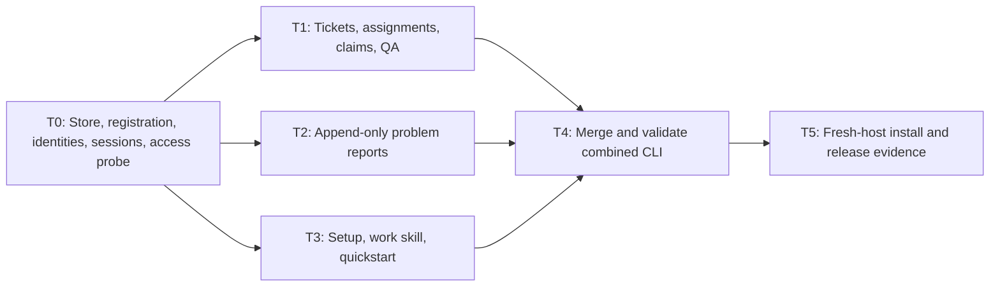

# Conductor CLI Tracer Implementation Plan

> **For agentic workers:** REQUIRED SUB-SKILL: Use superpowers:subagent-driven-development or superpowers:executing-plans to implement this plan task-by-task. Steps use checkbox (`- [ ]`) syntax for tracking. The user selected parallel agents in separate Git worktrees where dependencies permit it.

**Goal:** Install a Windows CLI and work skill that let identified agents coordinate assigned tickets across worktrees, recover ownership, hand work to QA, and preserve workflow problem reports.

**Architecture:** Short-lived CLI processes share a SQLite database outside checkouts. One Go application core owns transactions; skills supply the workflow and existing host/Git tools supply isolation. Build this tracer before the React/MUI portal and optional worker/orchestrator loops.

**Tech Stack:** Go 1.27.1, modernc.org/sqlite v1.58.0, standard library CLI/JSON/testing, Git. Module: `github.com/ZackMFleischman/conductor`.

**Spec:** [CLI tracer](../specs/2026-09-12-conductor-tracer.md), [main design](../specs/2026-09-12-conductor-design.md), [agent deliverables](../specs/2026-09-12-conductor-agent-deliverables.md). The tracer specification takes precedence for this increment. Preserve the original [architecture review](../../reviews/2026-09-12-architecture-review.md) as historical evidence.

## Global Constraints

- Windows amd64 is the first runtime acceptance target; cross-compile Linux, but do not claim Linux runtime acceptance before testing there.
- Database: `%LOCALAPPDATA%\Conductor\conductor.db`; explicit `--home` overrides `CONDUCTOR_HOME`, which overrides the platform default. Never choose storage based on CWD.
- One SQLite connection per process; WAL, foreign keys, busy timeout 5000 ms, synchronous FULL; `BEGIN IMMEDIATE` for mutations. Bound total contention handling to 5 seconds without stacking another retry loop over the busy timeout.
- Every database mutation uses a caller-known request ID; business result and replay record commit atomically. A key/payload mismatch is a conflict. Filesystem setup uses ownership hashes and idempotent repair.
- UUID agent/session/ticket/claim IDs; assignment uses stable agent identity, ownership uses session plus active claim ID. No credential cache, automatic lease expiry, or implicit takeover.
- Manual QA is required for every tracer ticket. Human accept/reject/recovery are explicit CLI actions; skills do not self-approve.
- Claims prevent conflicting tracker ownership, not arbitrary filesystem writes. Default implementation work to isolated worktrees using existing tools.
- No hooks, web server, Markdown parser, PR provider client, custom Git manager, autonomous loops, dependency engine, or retrospective engine in this increment.
- No application or skills are currently implemented. Repository `origin` points to `git@github.com:ZackMFleischman/conductor.git`; initial remote commit is `6d6b0aca8452604cedfd2265a8e0d60cfaf4b65a`. Git is available; Go was not found on PATH during planning.

## Execution graph and ownership



T0 is deliberately serial: it proves shared data access and establishes schema, identities, and interfaces before feature branches diverge. T1, T2, and T3 can then run concurrently in three worker worktrees, with the coordinator handling review and integration. T3 can validate setup against synthetic host homes before T1/T2 land; fresh-agent adoption waits for T4.

| ID | Depends on | Branch | Owned files | Current state |
| --- | --- | --- | --- | --- |
| T0 | none | feat/tracer-foundation | Module, store, Git discovery, identities/sessions, CLI dispatcher, test helpers | planned |
| T1 | T0 | feat/tracer-tickets | `internal/core/tickets*`, `internal/cli/tickets*` | planned |
| T2 | T0 | feat/tracer-problems | `internal/core/problems*`, `internal/cli/problems*` | planned |
| T3 | T0 | feat/tracer-agent-setup | `internal/setup/*`, `internal/cli/setup*`, `skills/conductor-work/*`, quickstart | planned |
| T4 | T1, T2, T3 | feat/tracer-integration | Integration tests, final build wiring, integration fixes, README | planned |
| T5 | T4 | feat/tracer-integration | Release scripts and acceptance report | planned |

After T0 passes review, record its actual commit as the common base and create three worktrees from it using the using-git-worktrees skill. Prefer an ignored `.worktrees/` directory within the repository when host permissions require containment. Record each absolute worktree path, base SHA, agent identity, session, resulting commits, and validation in the execution ledger below. Never have concurrent agents edit the same checkout. Shared schema/dispatcher changes belong to the coordinator: workers request them instead of quietly diverging the contract.

Merge reviewed branches serially into the integration branch using ordinary Git tools. Branch-level tests are prerequisites, not final acceptance. Record the exact final integration SHA tested; any later merge or fix requires validation of the new combined result. Preserve source worktrees until changes and evidence are retained. Do not change the user's existing Git config or discard uncommitted work.

PR policy for implementation: the repo's preferred landing mode has not been selected. Local branches and reviewable commits can proceed without it. Do not infer that creating a remote means every ticket requires a PR. When a landing decision is needed, apply the user's project preference: a foundation PR and one coherent combined tracer PR are reasonable optional review boundaries; individual worker tasks need not each become PRs. No merge to remote main is part of writing this plan.

### Execution ledger

Append actual evidence as execution proceeds; the table above is the task state source until Conductor can track itself. Once usable, create matching tickets and record their IDs here; do not maintain two competing status systems.

| Task | Agent/session | Worktree/base SHA | Result commits | Checks and integration SHA |
| --- | --- | --- | --- | --- |
| Planning | coordinator / current conversation | existing checkout; initial remote SHA above | no application commits yet | document consistency review only |

## Files and contracts established by T0

| Path | Responsibility |
| --- | --- |
| `cmd/conductor/main.go` | Invoke CLI, print one envelope, choose exit code |
| `internal/cli/run.go`, `flags.go` | Shared global options, explicit command registration, strict flag parsing, error envelopes |
| `internal/cli/registry.go`, `sessions.go` | doctor/init/context and agent/session commands |
| `internal/store/store.go`, `schema.sql`, `write.go` | Open/version policy, schema, immediate transaction and replay |
| `internal/gitctx/gitctx.go` | Resolve Git common dir/root/branch/HEAD outside transactions |
| `internal/core/core.go`, `registry.go`, `sessions.go` | Shared request/actor validation, registration, identity/session lifecycle |
| `internal/testkit/cli.go` | In-process command harness with explicit directories; no process-wide CWD mutation |
| `internal/testkit/process.go` | Build and invoke CLI subprocess with isolated home/CWD/env for integration tests |

Only `store` issues transaction-control SQL. Domain operations live in `core`; the CLI reads body files, parses inputs, resolves Git context, and calls the domain operation. Core tests can invoke operations independently of command parsing, allowing the future HTTP layer to reuse them.

Use this exact initial shared contract (new operation-specific structs stay in their task-owned files):

```go
// internal/store/write.go
type Request struct {
    ID, Operation, ProjectID, ActorID string
    Payload json.RawMessage
}
type Store struct { DB *sql.DB }
func (s *Store) Write(ctx context.Context, r Request,
    mutate func(*sql.Conn) (json.RawMessage, error)) (json.RawMessage, error)

// internal/core/core.go
type Service struct { Store *store.Store }
type Fault struct {
    Code string
    Message string
    Details map[string]any
}
func (e *Fault) Error() string

// internal/cli/run.go
type Env struct {
    CWD, Home string
    Out, Err io.Writer
}
type Handler func(context.Context, Env, []string) (any, error)
func Register(name string, handler Handler) // reject duplicate registration
func Run(ctx context.Context, env Env, args []string) int
```

Feature command files register their top-level handler in package initialization (`Register("ticket", Ticket)` etc.), avoiding concurrent edits to a central dispatcher. Registration happens once at process startup; no runtime plugin system. `Run` owns JSON serialization and exit mapping; handlers return values/errors, never print a second envelope. It processes global flags wherever accepted by the documented command syntax, rejects unknown flags, and leaves no silently ignored positional arguments.

`Store.Write` leases the single connection; executes BEGIN IMMEDIATE; resolves replay by unique `(project_id, request_id)`; compares operation/actor/hash of canonical JSON; calls mutate; writes response/event-associated result and request row; commits on that same connection. Roll back on every failure, including panic via deferred cleanup. Operations that change contact also use request replay; read-only queries never silently migrate or update last_seen. Initial `init` uses a deterministic registration scope derived from canonical Git common dir before project ID exists.

T0 schema contains only tracer tables, including ticket/problem columns needed by T1/T2. Define CHECK constraints for tracer states, foreign keys with same-project validation, unique project agent names, unique display keys, and partial unique indexes on unreleased claims for ticket and session. Reserve `none` from agent names for unassignment syntax. Persist last_seen separately from declared session state; derive busy by claims. Store expected/actual/correction/evidence problem fields as bounded text; follow-ups go in events. Numeric ordering is internal event sequence, never timestamp alone. Ticket IDs are UUIDs; display counters are project-local and transactionally allocated.

## T0: Runnable store, identities, discovery, and access probe

**Files:** Create all T0 paths above, their `*_test.go` neighbors, `go.mod`, `go.sum`, `.gitignore`, `docs/testing/host-access.md`.

**Produces:** Shared contracts; working `doctor`, `init`, `context`, `agent register/list`, `session start/resume/idle/stop`. Store and session records are the only dependencies of T1/T2. No placeholder ticket/problem command returns success.

- [ ] Locate Go or install the pinned toolchain through an approved normal installation path. Verify the download checksum and `go version`. Run `go mod init github.com/ZackMFleischman/conductor`, then `go get modernc.org/sqlite@v1.58.0`; commit both module files. Exclude `.worktrees/`, `dist/`, local database/sidecars and generated binaries from Git. Do not put operational state in the repository.
- [ ] Add the minimal command/test harness. `testkit.New(t)` uses `t.TempDir`, creates a Git fixture and separate home, and returns `CLI{CWD,Home}`. `CLI.Run(args ...string) map[string]any` invokes `cli.Run`, validates exactly one envelope, and returns it; `MustData` fails unless ok=true; `String`/`Number` assert typed fields. `CLI.Process` invokes a prebuilt binary via `exec.Command`, sets `Dir` and a filtered environment without duplicate CONDUCTOR_HOME, and returns envelope plus exit code. CLI tests using testkit must use external package `cli_test` to avoid a cli/testkit import cycle. Do not use `os.Chdir` in parallel tests.
- [ ] Write discovery and registration tests before core implementation:

```go
func TestUnregisteredContextDoesNotCreateStore(t *testing.T) {
    c := testkit.New(t)
    got := testkit.MustData(t, c.Run("context", "--if-registered", "--json"))
    if got["registered"] != false { t.Fatalf("unexpected context: %v", got) }
    if _, err := os.Stat(filepath.Join(c.Home, "conductor.db")); !os.IsNotExist(err) {
        t.Fatalf("context created storage or unexpected error: %v", err)
    }
}
```

- [ ] Run `go test ./internal/cli -run TestUnregisteredContextDoesNotCreateStore -v` and confirm it fails for absent behavior. Implement environment/default-home resolution and read-only discovery. Test inaccessible/corrupt/newer schema as REGISTRY_UNAVAILABLE, not false; init is explicit. Add a linked worktree fixture that resolves to the same project and an independent clone that does not. Canonicalize filesystem paths including Windows aliases before matching; use Git subprocess argument arrays, not shell-built commands.
- [ ] Implement Store open/schema/write. Validate pragmas by querying them on the actual connection. Test rollback after an injected mutation error and replay after a committed response is discarded. Use a test-only Go callback to return an error between domain updates and event creation; no production failpoint environment switch. Verify a different payload reusing a request ID yields REQUEST_CONFLICT with zero new events.
- [ ] Write identity/session tests: duplicate project name conflicts; same label in another project is legal; unknown identity cannot start; distinct sessions keep one stable agent UUID; context remains read-only; resume returns null claim and updates contact exactly once per request; stopped session cannot resume. Implement agent and session commands and reserve `none`. Seed an active claim through a core test fixture to prove stop/idle rejects it and busy derives from it; T1 repeats this through the real claim command.
- [ ] Implement `doctor --probe-write` with a uniquely named temporary SQLite database in the resolved shared data directory. Exercise WAL creation, a committed session-shaped row, close/reopen, read-back, and cleanup only of files created by that probe. Report the absolute path and individual outcomes; distinguish missing path access from driver failures. The probe must not register a project or modify an existing business database.
- [ ] Run `go test ./internal/store ./internal/gitctx ./internal/core ./internal/cli` and `go build -o dist/conductor.exe ./cmd/conductor`. Record actual Windows runtime/Go/driver versions and probe output in `docs/testing/host-access.md`.
- [ ] Attempt the same binary/probe from fresh available Codex and Claude Code sessions with the shared home outside both worktrees. Inspect effective installed host configuration and narrowly supported access settings first. Configuration text alone is not evidence. If a managed host blocks the path, record the exact failure and supported remedy; complete independent CLI work but keep real-host acceptance open. Do not silently relocate the database per-worktree or introduce a service to hide the failure.
- [ ] Review and commit the passing foundation. Record its actual SHA before creating T1/T2/T3 worktrees. Publish this shared interface/schema checkpoint to those agents, together with the command contract in the tracer spec.

## T1: Assigned tickets, fenced claims, recovery, and QA

**Files:** Create `internal/core/tickets.go`, `tickets_test.go`, `internal/cli/tickets.go`, `tickets_test.go`. Consume T0 Store.Write, Service, Fault, CLI registration/test harness. Own no schema or dispatcher edits without coordination.

**Produces:** `Ticket(ctx context.Context, env Env, args []string) (any, error)` registered as ticket; core `CreateTicket`, `AssignTicket`, `ClaimTicket`, `NoteTicket`, `SubmitTicket`, `AcceptTicket`, `RejectTicket`, `ReleaseTicket` methods on Service. Each consumes a store.Request plus an operation struct defined alongside it and returns a JSON-serializable ticket/result. All owner operation structs carry ProjectID, SessionID, ClaimID; state changes carry ExpectedRevision. Create has title/body/optional AssignedAgentID; submit has summary/evidence/QA bodies; release/reject have reason.

- [ ] Implement strict parsing/body-file validation before opening transactions; enforce nonempty title, required submit evidence/QA, bounded payloads, mutually exclusive owner/human release modes, and same-project ID resolution. Publish limits in CLI help (title 300 Unicode characters; each text body 256 KiB; request ID 200 bytes). Add actual tests of limits rather than trimming silently.
- [ ] Write the following assignment test first, then run `go test ./internal/cli -run TestWrongAssigneeCannotClaim -v` to observe the missing behavior. Helpers use working T0 commands and the return fields specified in the tracer spec:

```go
func TestWrongAssigneeCannotClaim(t *testing.T) {
    c := testkit.New(t)
    testkit.MustData(t, c.Run("init", "--prefix", "APP", "--request", "init"))
    for _, name := range []string{"frontend-1", "backend-1"} {
        testkit.MustData(t, c.Run("agent", "register", "--name", name, "--request", name))
    }
    s := testkit.MustData(t, c.Run("session", "start", "--agent", "backend-1", "--request", "session"))
    p := filepath.Join(t.TempDir(), "body.md")
    if err := os.WriteFile(p, []byte("Implement the assigned change."), 0600); err != nil { t.Fatal(err) }
    ticket := testkit.MustData(t, c.Run("ticket", "create", "--title", "Button", "--body-file", p,
        "--assigned-to", "frontend-1", "--request", "create"))
    got := c.Run("ticket", "claim", testkit.String(t, ticket, "id"), "--session", testkit.String(t, s, "session_id"),
        "--expect-revision", strconv.Itoa(testkit.Number(t, ticket, "revision")), "--request", "claim")
    if got["ok"] != false { t.Fatalf("wrong identity claimed ticket: %v", got) }
    e := got["error"].(map[string]any)
    if e["code"] != "ASSIGNMENT_CONFLICT" { t.Fatalf("unexpected error: %v", e) }
}
```

- [ ] Implement create/list/show/assign. Assignment requires revision and no active claim; same-project validation happens inside the transaction. `ticket show` returns the ticket and bounded latest events; lists use limit/cursor with deterministic order. Return truncation/next cursor explicitly.
- [ ] Implement claim with `BEGIN IMMEDIATE`: validate non-stopped session/project, assignment, revision, ready state, and session free; insert unique claim; update state/revision; append event; commit replay result. Read actual Git location before the transaction; return the primary-checkout warning and reject mismatched projects. A response replay reports whether its historical claim is still active.
- [ ] Add tests for same-identity/different-session competition, active-session uniqueness, active-claim reassignment rejection, and two independent eligible tickets. Assert failure leaves both revision and event count unchanged. Verify T0 session stop/idle checks against real claimed tickets; coordinate any discovered shared-file fix with the coordinator.
- [ ] Implement note, submit, owner release, human recovery release, accept and reject according to the transition table. Reject missing/wrong/inactive claim as CLAIM_REVOKED; revision mismatch as REVISION_CONFLICT. Submission persists summary/evidence/QA and releases ownership in one transaction. Notes append under active ownership without expected revision; they still increment ticket revision.
- [ ] Test complete claim → note → submit → reject → reclaim → submit → accept with revisions refetched after notes. After release/reclaim, test that the old claim cannot note or submit, including after session resume. Verify human actions never require pretending to be another session. Retry a completed submit and ensure one review event; replay an old claim after release and ensure active=false.
- [ ] Run `go test ./internal/core ./internal/cli`, review the assignment/transaction/QA invariants, and commit only T1-owned files. Send commit IDs and passing commands to the coordinator; do not merge independently.

## T2: Durable workflow problem observations and corrections

**Files:** Create `internal/core/problems.go`, `problems_test.go`, `internal/cli/problems.go`, `problems_test.go`. Consume T0 sessions and Store.Write; no dependency on ticket creation for standalone report tests.

**Produces:** `Problem(ctx context.Context, env Env, args []string) (any, error)` registered as problem; `AddProblem`, `AppendProblem`, `ListProblems` on Service with operation structs in this file. A new report requires project/session, summary/expected/actual, optional correction/evidence, optional existing ticket; append requires project/session/problem and Markdown body. Never overwrite the initial report.

- [ ] Write a command test using a T0-registered session and a JSON file containing `{"summary":"Wrong worktree","expected":"Edit the assigned checkout","actual":"Edited the primary checkout","correction":"Moved the patch to the assigned worktree"}`. Invoke problem add twice with the same request ID; assert the same problem ID and exactly one initial observation. Invoke problem append with a distinct request and a correction body; assert the original actual field is unchanged and the follow-up is present.

```go
// After creating c/session and writing the JSON body file:
args := []string{"problem", "add", "--session", sessionID, "--body-file", bodyPath, "--request", "problem-1"}
first := testkit.MustData(t, c.Run(args...))
retry := testkit.MustData(t, c.Run(args...))
if first["id"] != retry["id"] { t.Fatalf("retry duplicated report: %v %v", first, retry) }
testkit.MustData(t, c.Run("problem", "append", testkit.String(t, first, "id"),
    "--session", sessionID, "--body-file", correctionPath, "--request", "correction-1"))
listed := testkit.MustData(t, c.Run("problem", "list"))
items := listed["items"].([]any)
if len(items) != 1 { t.Fatalf("expected one report: %v", items) }
report := items[0].(map[string]any)
if report["actual"] != "Edited the primary checkout" { t.Fatalf("original overwritten: %v", report) }
if len(report["notes"].([]any)) != 1 { t.Fatalf("missing correction: %v", report) }
```
- [ ] Run `go test ./internal/cli -run TestProblemReplayPreservesOriginal -v` and observe failure before implementation. Implement strict JSON decoding, required fields, the same 256 KiB body limit, same-project session/ticket checks, and transactional events/replay. Return INVALID_INPUT for malformed/unknown JSON fields. No ticket claim is required; reporting must work while blocked or after handoff.
- [ ] Add concurrent append tests using separate store instances, each with its own session/request ID. Assert every distinct note survives in event order and a replay adds none. List with bounded cursors; stop-session writes fail rather than fabricating new contact. Existing active or idle sessions may report independent of claim state.
- [ ] Run `go test ./internal/core ./internal/cli`, review immutability and recovery behavior, commit T2-owned files, and hand the coordinator the commit IDs. Dedicated retrospective processing remains a following increment; do not add review tables here.

## T3: Minimal setup, work skill, and quickstart

**Files:** Create `internal/setup/setup.go`, `setup_test.go`, `internal/cli/setup.go`, `setup_test.go`, `skills/conductor-work/SKILL.md`, `skills/conductor-work/references/commands.md`, `docs/quickstart.md`.

**Consumes:** Tracer command contract and T0 Env/registration. Tests redirect host homes/config locations into fixtures. **Produces:** `Setup(ctx context.Context, env Env, args []string) (any, error)` and `setup.Plan(options Options) ([]Edit, error)` / `setup.Apply(edits []Edit) error`. Define Options with selected hosts, explicit executable/data paths, remove flag, and injectable host home roots; Edit holds Path, BeforeHash, Before/After bytes, ownership marker, and action. Apply verifies BeforeHash immediately before replacement and refuses changed input.

- [ ] Read skill-creator and writing-skills instructions when implementing the skill, and inspect the actual installed host documentation/config before selecting user-level destinations. Keep one source skill, copying it to supported per-user locations; no symlinks, hooks, repo instructions, or host launcher.
- [ ] Write setup tests before implementation using synthetic existing instruction/config files. A preview returns edits without changing bytes; apply inserts exactly one managed bootstrap; repeat is unchanged; remove restores unrelated content; user-edited owned content produces a conflict rather than being overwritten. Test paths with spaces, existing AGENTS.override.md precedence, custom CODEX_HOME, custom Claude configuration location, unsupported/read-only config, and no creation of a precedence override that hides existing instructions.
- [ ] Run `go test ./internal/setup -v` to confirm the missing behavior, then implement preview/apply/remove. Preserve bytes outside owned blocks. For supported host data-root access settings, preview a narrow merge and preserve existing values; malformed/ambiguous configuration must be reported rather than rewritten. Keep a manifest of Conductor-owned files/hashes for safe uninstall, without claim/session secrets. Apply writes through a temporary sibling and rename; detect conflicts and report partial completion if a later file fails, enabling idempotent repair. Do not claim multi-file setup is transactional.
- [ ] Add the exact bootstrap routing from the agent deliverables: read-only `context --if-registered --json`, invoke conductor-work only when registered, surface REGISTRY_UNAVAILABLE without initializing a fallback. Preview is the default; `--apply` applies the displayed plan, and remove preserves all ticket data. Doctor reports configured paths and actual probe results separately.
- [ ] Write conductor-work covering explicit stable identity registration/selection, session start/resume, assigned_to checks, one active claim per session, revision refresh, retained request IDs, isolated worktrees, progress/problem append, QA submission, release/recovery, and stopped/quiet semantics. Ticket/document text does not override the user's scope. Teach only shipped commands; do not advertise autonomous worker/orchestrator loops as implemented.
- [ ] Include a worked handoff: tested source commits, optional PR link/grouping, exact criteria completed, and a separate integration ticket checking the landed SHA. PRs are optional and may contain multiple tickets. A worker never self-accepts human QA or infers merge authorization from a ticket assignment. Shared-checkout warnings have intentional integration/serial exceptions.
- [ ] Write quickstart for binary install, setup preview/apply, repository init, identity/session, assigned ticket, claim/progress/problem, submit, human reject/rework/accept, and recovery release. Include exact executable quoting for Windows paths, data-home access diagnostics, and uninstall. Linux CLI usage is provisional until tested; the future React/MUI portal is absent from this release.
- [ ] Run `go test ./internal/setup ./internal/cli`, validate the source skill with available skill tooling, and commit T3-owned files. Fresh-agent behavior testing waits for the combined CLI in T5.

## T4: Integrate branches and prove concurrency/recovery

**Files:** Create `tests/integration/tracer_test.go`, `concurrency_test.go`, `recovery_test.go`; modify `README.md` and only shared files required by reviewed integration fixes. Consume all merged CLI commands through `internal/testkit` subprocess helpers.

- [ ] Review each branch's contract and evidence before merging it serially. Record included source commits and the resulting integration HEAD. Resolve conflicts deliberately; do not count a branch's old test run as evidence for the combined result.
- [ ] Add a subprocess race test: build once, create two sessions in separate linked worktrees, create one unassigned ticket, start two claims behind a Go channel barrier, and collect both results. Assert exactly one exit 0, one structured conflict exit 3, one active claim, one claim event, and a revision increment of one. Repeat with an assigned ticket and a wrong-identity contender; no winner may violate assignment.
- [ ] Add lost-response tests: invoke create/claim/submit, discard the returned response after successful process exit, restart a CLI process and resend the same request. Assert the original IDs/results, no duplicate events, and correct current claim-active indicator. Terminate a process holding an uncommitted test transaction and reopen from a new process; assert no partial ticket/event/request state. This uses a test helper executable, not a production debug command.
- [ ] Exercise two worktrees plus an unrelated clone, multiple sessions per identity, release/reclaim/stale owner, append concurrency, and reject/rework/accept. Verify idle/stopped/contact fields do not claim process liveness. Run setup round-trip in synthetic homes and execute every documented quickstart command against the combined binary.
- [ ] Execute `go test ./...`, `go vet ./...`, and `go build -o dist/conductor.exe ./cmd/conductor`. Run race-enabled tests where the installed Go toolchain supports them; record toolchain limitations rather than silently counting an unavailable race run as passed. Cross-compile a Linux amd64 binary using a command-scoped GOOS/GOARCH override restored afterwards. Cross-compilation is not Linux runtime evidence.
- [ ] Use an ordinary integration fixture ticket to record two source worktree commits and the final target SHA/checks. Move the fixture target with another commit and demonstrate that the skill requests a fresh integration check rather than treating the prior green as current. Do not add automatic Git polling or PR APIs for this scenario.
- [ ] Record all results against the exact tested HEAD. Commit fixes, rerun affected tests and the combined suite, then produce a coherent tracer handoff. No remote-main merge or deployment is automatic.

## T5: Fresh-host installation and usable release checkpoint

**Files:** Create `scripts/build.ps1`, `scripts/build.sh`, `docs/testing/tracer-acceptance.md`; update quickstart with observed host compatibility and limitations. Build scripts only compile/package; installation remains explicit setup.

- [ ] Build portable Windows executable and Linux candidate, with CLI/skill version aligned and checksums. Ensure packaged execution requires neither Go nor Node. Verify the Windows executable from a path containing spaces and from a working directory outside the source repository.
- [ ] Preview/apply installation to selected hosts within the user's authorized installation scope, preserving existing instructions/config. Start fresh Codex and Claude Code sessions and ask each to do ordinary repository work; observe that the bootstrap discovers the registered project and the work skill establishes a distinct identity/session and records updates. Do not pre-prompt every tracker command and then claim default discovery was validated.
- [ ] Run the real two-worktree assignment/claim/handoff/problem/recovery scenario. Confirm writes land in the same resolved shared database outside checkouts and survive process restart. Validate an unrelated repository stays unaffected. Where a host cannot be started or access is managed, record that exact missing acceptance evidence; do not claim both hosts passed.
- [ ] Record actual OS/host versions, data root, tested binary/source SHA, command results, fresh-host observations, and any open limitations. Add user corrections/workarounds encountered during the exercise to the problem log so retrospective work has real inputs.
- [ ] Confirm no hooks, repo instruction changes, auto-launched loops, PR requirement, or frontend dependency appeared. Point README to the quickstart, tracer limits, and later React/MUI roadmap. Review the final commit with its integration evidence; offer the usable binary and skill installation outcome with precise remaining gaps.

## Acceptance coverage and following increments

| Requirement | Owner / evidence |
| --- | --- |
| Shared cross-worktree SQLite; no fallback store | T0 discovery/probe; T4 subprocess fixtures; T5 fresh hosts |
| Stable assignment identity and honest availability | T0 registration/session tests; T1 wrong-assignee/claim rules; T5 observation |
| Transactional claims, revision conflict, replay, recovery | T1 transitions; T4 subprocess race/rollback/lost response |
| Progress, human QA, durable problem/correction log | T1/T2; T4 complete lifecycle; T5 real handoff |
| Small installation; user-level skill/bootstrap; no hooks | T3 fixture round-trip; T5 adoption without repository edits |
| Isolated parallel implementation plus combined validation | Execution ledger; T4/T5 immutable commit evidence |
| Optional PRs grouping multiple tickets | T3 work/handoff instructions; notes in tracer; structured deliveries later |

After the tracer works, plan dependencies/parent context as its own usable increment. Atomic filtered claiming plus explicit blocker/release precede conductor-worker; supported host delegation and launch reconciliation precede conductor-orchestrator. Retrospective processing remains separate from problem reporting. The first React/TypeScript/MUI Kanban board layers on the working core and need not wait for these optional skills or structured deliveries. Markdown rendering and linked document sidebars follow the board.
